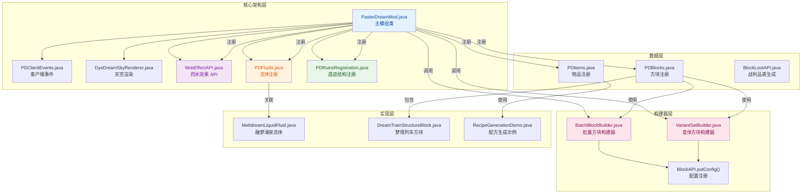

## 1. 高层摘要 (TL;DR)

*   **影响范围**: 🔴 **高** - 涉及核心架构重构、新增多个 API 系统、大量物品/方块注册和客户端渲染优化
*   **主要变更**:
    *   🏗️ **架构重构**: 客户端事件从手动注册改为 `@EventBusSubscriber` 注解自动注册，避免服务端类加载问题
    *   ✨ **新增 API 系统**: 药水效果 API (`MobEffectAPI`)、流体注册系统 (`PDFluids`)、遗迹结构注册 (`PDRuinsRegistration`)
    *   🧱 **方块构建器增强**: `BatchBlockBuilder` 和 `VariantSetBuilder` 新增 `mineable()` 方法，支持批量配置挖掘工具类型
    *   📦 **大规模物品迁移**: 使用 `ItemMigrationAPI` 重构 20+ 物品的注册方式
    *   🎨 **客户端优化**: 新增深海荧光羽毛和蘑菇孢子粒子效果，优化粒子生成性能

---

## 2. 可视化概览 (代码与逻辑映射)



---

## 3. 详细变更分析

### 🏗️ 3.1 核心架构重构

#### **PasterDreamMod.java** - 主模组类

**变更内容**:
- ✅ 移除手动客户端事件注册代码，避免服务端加载客户端类
- ✅ 新增流体注册系统（`PDFluids` 和 `PDFluidsType`）
- ✅ 新增遗迹结构注册调用（`PDRuinsRegistration.register()`）
- ✅ 新增药水效果 API 注册（`MobEffectAPI.REGISTRY`）

**代码变更**:
```java
// ❌ 移除：手动注册客户端事件
- NeoForge.EVENT_BUS.addListener(PDClientEvents::onClientTick);
- NeoForge.EVENT_BUS.addListener(DyeDreamSkyRenderer::onRenderLevelStage);

// ✅ 新增：注释说明改为注解自动注册
+ // 客户端 Tick 事件和极光天幕渲染器通过 @EventBusSubscriber(Dist.CLIENT)
+ // 在 PDClientEvents 和 DyeDreamSkyRenderer 中自动注册，避免服务端类加载

// ✅ 新增：注册流体
+ PDFluidsType.FLUID_TYPES.register(modEventBus);
+ PDFluids.FLUIDS.register(modEventBus);

// ✅ 新增：注册遗迹结构
+ PDRuinsRegistration.register();
```

---

### ✨ 3.2 新增 API 系统

#### **MobEffectAPI.java** - 药水效果注册 API

**功能描述**: 全新的药水效果注册系统，采用 Facade + Builder 模式，支持：
- 链式配置效果属性
- 着色器支持
- 粒子联动
- 回调系统（应用/移除时执行自定义逻辑）
- 效果叠加交互

**使用示例**:
```java
MobEffectResult dreamwish = MobEffectAPI.createEffect("dreamwish_buff")
    .beneficial()
    .color(0xFF69B4)
    .shaderTexture(new ResourceLocation("pasterdream", "shaders/post/dreamwish.json"))
    .particleType(ParticleTypes.END_ROD)
    .onApply((entity, amp) -> entity.heal(5))
    .build();
```

#### **PDFluids.java & PDFluidsType.java** - 流体注册系统

**功能描述**: 使用 NeoForge `DeferredRegister` 模式注册自定义流体

**注册内容**:
| 流体名称 | 类型 | 属性 |
|---------|------|------|
| `meltdream_liquid` | 源流体 | 静止态，amount=8 |
| `flowing_meltdream_liquid` | 流动流体 | 流动态，amount 随 LEVEL 变化 |

**流体类型属性**:
- 不可游泳
- 路径类型：熔岩
- 光照等级：12
- 粘度：100
- 温度：10

#### **PDRuinsRegistration.java** - 遗迹结构注册

**功能描述**: 使用 `RuinAPI` + `JigsawStructure` 注册 6 个遗迹结构

**注册的遗迹**:

| 结构名称 | 生成位置 | 高度 | 间距/分离 | 描述 |
|---------|---------|------|----------|------|
| `dream_train` | 染梦维度 | Y=55 | 258/179 | 染梦列车，空中漂浮 |
| `dyedream_worldtree` | 染梦维度 | Y=-25 | 289/165 | 巨型染梦树，地下生长 |
| `pinkagaric_house_0~3` | 染梦维度 | Y=-4 | 78/42 | 4 种粉红菇屋 |
| `struct_dyedream_crack_1` | 主世界 | Y=32 | 37/20 | 染梦裂隙，传送入口 |
| `desert_cottage_0` | 主世界 | Y=0 | 60/48 | 沙漠小屋 |

---

### 🧱 3.3 方块构建器增强

#### **BatchBlockBuilder.java** - 批量方块构建器

**新增功能**: `mineable()` 方法

**作用**: 批量设置所有方块所需的工具类型，自动注册到对应的 `mineable/*` 标签中

**代码变更**:
```java
// ✅ 新增字段
+ @Nullable
+ private String mineable;

// ✅ 新增方法
+ public BatchBlockBuilder mineable(String mineable) {
+     this.mineable = mineable;
+     return this;
+ }

// ✅ 构建时自动配置
+ BlockConfig config = mineable != null ? BlockConfig.of().mineable(mineable) : null;
+ if (config != null) {
+     BlockAPI.putConfig(fullName, config);
+ }
```

#### **VariantSetBuilder.java** - 变体方块构建器

**新增功能**: `mineable()` 方法

**作用**: 为所有变体方块（楼梯、台阶、墙、栅栏等）统一配置挖掘工具类型

**代码变更**:
```java
// ✅ 新增字段
+ @Nullable
+ private String mineable;

// ✅ 新增方法
+ public VariantSetBuilder mineable(String mineable) {
+     this.mineable = mineable;
+     return this;
+ }

// ✅ 构建时自动配置所有变体
+ if (mineable != null) {
+     BlockConfig config = BlockConfig.of().mineable(mineable);
+     registerVariantConfig(stairs, "_stairs", config);
+     registerVariantConfig(slab, "_slab", config);
+     registerVariantConfig(wall, "_wall", config);
+     // ... 其他变体
+ }
```

---

### 📦 3.4 物品注册重构

#### **PDItems.java** - 大规模物品迁移

**迁移方式**: 使用 `ItemMigrationAPI` 替代手动注册

**迁移物品统计**:

| 类别 | 物品数量 | 示例 |
|------|---------|------|
| 食物类 | 5+ | `amber_candy`, `bread_slice`, `cake_base`, `fig` |
| 饰品类 | 3 | `embryo_ring`, `test_curio` |
| 简单物品 | 3 | `dream_coin_0`, `dream_coin_1`, `elixir_bottle`, `glassjar` |
| 唱片类 | 3 | `sweetdream_disc`, `dyedream_world_disc`, `wind_journey_1_disc` |
| 特殊物品 | 4 | `jungle_spore`, `meltdream_liquid_bucket`, `pinkegg`, `pliers` |

**代码变更示例**:
```java
// ❌ 旧方式：手动注册
- public static final DeferredItem<Item> AMBER_CANDY = ITEMS.register("amber_candy",
-         () -> new AmberCandyItem(new Item.Properties()));

// ✅ 新方式：使用 ItemMigrationAPI
+ public static final DeferredItem<Item> AMBER_CANDY =
+         ItemMigrationAPI.foodItem("amber_candy")
+                 .nutrition(0).saturationModifier(0f)
+                 .build();
```

**新增物品**:
- `DREAM_CAULDRON` - 梦境炼药锅物品
- `MELTDREAM_CHEST` - 融梦水晶箱（关闭）
- `MELTDREAM_CHEST_OPEN` - 融梦水晶箱（打开）
- `JUNGLE_SPORE` - 丛林孢子（食物）
- `MELTDREAM_LIQUID_BUCKET` - 融梦涌泉桶
- `PINKEGG` - 粉红蛋
- `PLIERS` - 钳子（耐久度 160）

---

### 🎨 3.5 客户端渲染优化

#### **PDClientEvents.java** - 客户端事件处理器

**变更内容**:
- ✅ 使用 `@EventBusSubscriber` 注解自动注册
- ✅ 新增深海荧光羽毛粒子效果
- ✅ 新增蘑菇孢子粉尘粒子效果
- ✅ 性能优化：减少扫描数量、添加区块加载检测、优化高度计算

**代码变更**:
```java
// ✅ 新增注解
+ @EventBusSubscriber(modid = PasterDreamMod.MOD_ID, value = Dist.CLIENT, bus = EventBusSubscriber.Bus.GAME)
+ public class PDClientEvents {

// ✅ 新增订阅事件
+ @SubscribeEvent
  public static void onClientTick(ClientTickEvent.Post event) {

// ✅ 新增暂停检测
+ if (mc.isPaused()) return;

// ✅ 新增粒子效果
+ } else if (BIOME_DYEDREAM_DEEP_OCEAN.equals(currentBiome)) {
+     spawnDeepOceanBioluminescence(mc);
+ } else if (BIOME_DYEDREAM_MUSHROOM_PLAINS.equals(currentBiome)) {
+     spawnMushroomSpores(mc);
+ }

// ✅ 性能优化：减少扫描数量
- for (int i = 0; i < 10; i++) {
+ for (int i = 0; i < 5; i++) {

// ✅ 性能优化：添加区块加载检测
+ if (!isChunkLoaded(mc, checkPos)) continue;

// ✅ 性能优化：避免昂贵的 getHeight 查询
- int floorY = mc.level.getHeight(..., (int) spawnX, (int) spawnZ);
+ double playerFloorY = mc.player.getY() - 2.0;
```

**新增粒子效果**:

| 粒子类型 | 生物群系 | 描述 | 颜色/效果 |
|---------|---------|------|----------|
| `feather_white_particle` | 晶莹深海 | 白色荧光羽毛从海面缓缓上浮 | 12帧动画，夜晚发光 |
| `dyedream_0_particle` | 蘑菇平原 | 暖金色孢子从地面飘散 | 大小脉冲呼吸，横向风漂 |

#### **DyeDreamSkyRenderer.java** - 天空渲染器

**变更内容**:
- ✅ 使用 `@EventBusSubscriber` 注解自动注册

**代码变更**:
```java
// ✅ 新增注解
+ @EventBusSubscriber(modid = PasterDreamMod.MOD_ID, value = Dist.CLIENT, bus = EventBusSubscriber.Bus.GAME)
+ public class DyeDreamSkyRenderer {

// ✅ 新增订阅事件
+ @SubscribeEvent
  public static void onRenderLevelStage(RenderLevelStageEvent event) {
```

---

### 🧱 3.6 方块注册扩展

#### **PDBlocks.java** - 方块注册

**新增方块**:

| 方块名称 | 类型 | 特殊属性 |
|---------|------|---------|
| `dream_train_structure` | 梦境列车结构 | 右键发送消息，金属音效 |
| `the_endless_book_of_dream_seekers` | 寻梦者的永恒书卷 | GeckoLib 3D 模型，1 格库存，光照等级 8 |
| `dream_cauldron` | 梦境炼药锅 | GeckoLib 3D 模型，3 输入槽 + 1 输出槽 |
| `meltdream_chest` | 融梦水晶箱（关闭） | GeckoLib 动画，三级随机宝藏，光照等级 8 |
| `meltdream_chest_open` | 融梦水晶箱（打开） | 无动画，可打开 GUI |
| `meltdream_liquid` | 融梦涌泉流体 | 爆炸抗性 100，tickRate 3 |

**新增移植物方**:
- 钛系列：`titanium_block`, `raw_titanium_block`, `deepslate_titanium_ore`
- 熔金系列：`moltengold_block`, `moltengold_ore`
- 其他：`blackmetal_block`, `charged_amethyst_block`, `wind_iron_block`, `soul_ore`
- 作物：`crop_0a` ~ `crop_4a`
- 装饰：`pebble_0`, `shadow_light_0`, `vine_0`, `goldenrod`

**钙华变体系列**:
- `polished_calcite`, `calcite_tiles`
- 楼梯、台阶、墙变体

**移除方块**:
- `stripped_dyedream_log`, `stripped_dyedream_wood` (去皮染梦原木)

---

### 🔧 3.7 Bug 修复

#### **BlockLootAPI.java** - 战利品表生成路径修复

**问题**: 战利品表生成路径拼写错误

**修复**:
```java
// ❌ 错误路径
- Path outputDir = Paths.get(basePath, "data", modId, "loot_tables", "blocks");

// ✅ 正确路径
+ Path outputDir = Paths.get(basePath, "data", modId, "loot_table", "blocks");
```

#### **LootTableGenerator.java** - 战利志表生成器路径修复

**修复**: 同上，统一修正为 `loot_table` 而非 `loot_tables`

---

### 📝 3.8 新增示例代码

#### **RecipeGenerationDemo.java** - 配方生成示例

**功能**: 演示如何使用 `RecipeGenerator` 生成配方 JSON 文件

**支持的配方类型**:
1. 有序合成（Shaped）
2. 无序合成（Shapeless）
3. 烧炼配方（Smelting / Blasting / Campfire / Smoking）
4. 切石机配方（Stonecutting）

**生成的配方示例**:
- 铜工具系列（剑、镐、斧、锹、锄）
- 食物合成（苹果汁、三明治、面团、西瓜汁）
- 矿石冶炼（钛锭、熔金锭、面包片）
- 石英方块加工（砖块、雕纹、平滑、柱状、楼梯、台阶、墙）

---

### 🌊 3.9 流体实现

#### **MeltdreamLiquidFluid.java** - 融梦涌泉流体

**实现方式**: 继承 NeoForge `BaseFlowingFluid`

**流体属性**:
```java
public static final Properties PROPERTIES = new Properties(
    PDFluidsType.MELTDREAM_LIQUID_TYPE,
    PDFluids.MELTDREAM_LIQUID,
    PDFluids.FLOWING_MELTDREAM_LIQUID
)
.explosionResistance(100f)  // 爆炸抗性 100
.tickRate(3)                // tick 速率 3
.bucket(() -> PDItems.MELTDREAM_LIQUID_BUCKET.get())
.block(() -> PDBlocks.MELTDREAM_LIQUID.get());
```

**子类**:
- `Source` - 源流体（静止态，amount=8）
- `Flowing` - 流动流体（amount 随 LEVEL 变化）

---

### 🚂 3.10 特殊方块实现

#### **DreamTrainStructureBlock.java** - 梦境列车结构方块

**功能**: 装饰性方块，右键点击时发送列车到站提示消息

**代码实现**:
```java
@Override
protected InteractionResult useWithoutItem(BlockState state, Level level, BlockPos pos, Player player, BlockHitResult hitResult) {
    if (!level.isClientSide()) {
        player.sendSystemMessage(Component.literal("§6列车即将到站，请做好准备..."));
    }
    return InteractionResult.SUCCESS;
}
```

---

## 4. 影响与风险评估

### ⚠️ 4.1 破坏性变更

| 变更类型 | 影响范围 | 风险等级 | 说明 |
|---------|---------|---------|------|
| 客户端事件注册方式 | `PasterDreamMod.java` | 🟡 中 | 从手动注册改为注解注册，需确保 `@EventBusSubscriber` 正确配置 |
| 物品注册方式 | `PDItems.java` | 🟡 中 | 20+ 物品改用 `ItemMigrationAPI`，需验证物品功能正常 |
| 战利志表路径 | `BlockLootAPI.java` | 🟢 低 | 路径拼写修正，不影响运行时（仅影响生成） |
| 移除方块 | `PDBlocks.java` | 🟡 中 | 移除去皮染梦原木，需确认无引用 |

### 🧪 4.2 测试建议

**核心功能测试**:
- ✅ 验证客户端事件正常触发（粒子、天空渲染、音乐管理）
- ✅ 验证药水效果 API 注册和功能
- ✅ 验证流体系统（放置、流动、桶装）
- ✅ 验证遗迹结构生成（染梦维度和主世界）

**物品/方块测试**:
- ✅ 验证迁移的 20+ 物品功能正常
- ✅ 验证新增方块（梦境列车、炼药锅、融梦水晶箱）
- ✅ 验证挖掘工具类型配置（Jade 模组显示）
- ✅ 验证钙华变体系列方块

**性能测试**:
- ✅ 测试深海和蘑菇平原粒子性能
- ✅ 测试区块加载检测优化效果
- ✅ 测试暂停时粒子生成优化

**兼容性测试**:
- ✅ 服务端启动测试（确保不加载客户端类）
- ✅ 客户端启动测试（确保事件正常注册）
- ✅ 多人联机测试

---

## 5. 总结

本次代码变更是一次**大规模的功能扩展和架构优化**，主要亮点包括：

1. **架构现代化**: 客户端事件从手动注册改为注解注册，符合 NeoForge 最佳实践
2. **API 体系完善**: 新增药水效果、流体、遗迹结构三大 API 系统
3. **构建器增强**: 批量方块和变体方块构建器支持挖掘工具类型配置
4. **内容丰富**: 新增 20+ 物品、30+ 方块、6 个遗迹结构、2 种粒子效果
5. **性能优化**: 粒子生成性能优化，减少区块加载和高度查询开销
6. **Bug 修复**: 修正战利志表生成路径拼写错误

**建议**: 在合并前进行全面的功能测试和性能测试，特别是客户端事件注册和流体系统的稳定性。