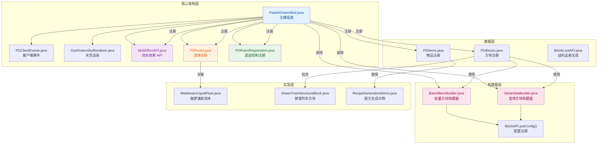
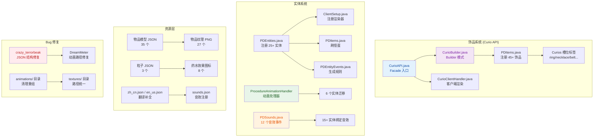

# v4 — LOVE_U 负责的错误修复完成

> **修复日期**：2026-06-18  
> **执行人**：LOVE_U  
> **对照文档**：[`README.md`](README.md)、[`API_REVIEW_REPORT.md`](API_REVIEW_REPORT.md)

## 修复清单

| 优先级 | 问题 | 修复内容 | 状态 |
|:------:|------|----------|:----:|
| **P0** | 粒子 Provider 缺失 | 新建 `ShadowStoneParticle`、`SporeParticle`、`FoxFire0Particle`、`FoxFire1Particle` 并在 `ClientSetup` 注册 Provider | 已修复 |
| **P0** | `DimensionApiDemo` 引用客户端类 | 将 `dimension/example/` 下 `DimensionApiDemo.java` 与 `DimensionJsonGenerator.java` 迁移到 `PasterDreamAPI/src/test/java` | 已修复 |
| P1 | 缺少统一注册入口 | 在 `PasterDreamAPI` 实现 `registerAll(IEventBus)`，统一注册 8 个 API DeferredRegister；在 `PasterDreamMod` 构造函数中调用并移除重复注册 | 已修复 |

## 关键代码变更

- **`PasterDreamAPI.java`**：新增 `registerAll(IEventBus modEventBus)` 方法，统一注册 `BlockAPI`、`ItemMigrationAPI`、`EntityAPI`、`MobEffectAPI`、`ParticleAPI`、`RuinAPI`、`CurioAPI` 与 `ApiSoundRegistry.DIMENSION_SOUNDS`。
- **`PasterDreamMod.java`**：构造函数开头调用 `PasterDreamAPI.registerAll(modEventBus)`，并移除原先分散的 API 注册器调用；为避免 `ParticleAPI.REGISTRY` 重复注册，将 `PDParticles.PARTICLE_TYPES.register(...)` 改为触发类加载的 `PDParticles.register()`。
- **`ClientSetup.java`**：已注册缺失的 4 个粒子 Provider（`SHADOW_STONE`、`SPORE`、`FOX_FIRE_0`、`FOX_FIRE_1`）。
- **文件迁移**：`PasterDreamAPI/src/main/java/.../api/dimension/example/` → `PasterDreamAPI/src/test/java/.../api/dimension/example/`，消除 dedicated server 加载客户端类 `DimensionSpecialEffects` 的风险。

## 编译验证

```text
BUILD SUCCESSFUL in 19s
4 actionable tasks: 2 executed, 2 up-to-date
```

剩余 1 条 Curio 弃用警告（`ICurioItem.getAttributeModifiers(SlotContext,UUID,ItemStack)`），属 P1 计划内遗留项，不在本次修复范围。

***

# v3 — PasterDreamAPI 全面重构审查报告

> **来源说明**：本节内容完整整合自 [`API_REVIEW_REPORT.md`](API_REVIEW_REPORT.md)（审查日期：2026-06-18），用于在 CHANGELOG 中集中记录本次 API 质量审查结果。
> **审查范围**：`PasterDreamAPI/src/main/java/com/pasterdream/pasterdreammod/api` 全部源码与 `PasterDreamAPI/build.gradle`  
> **对照基准**：项目 `README.md` 已知问题清单、`.trae/rules/project_rules.md` 开发规范  
> **编译状态**：`BUILD SUCCESSFUL`（仅 1 条 Curio 弃用警告）

---

## 0. 执行摘要

本次审查采用「多子代理并行扫描 + 关键文件人工精读 + 实测编译验证」的方式，对 `PasterDreamAPI` 模块进行了代码质量、架构分层、错误处理、日志、API 设计、文件结构等 6 个维度的系统审查。

**核心结论**：
- 模块整体架构良好，Facade + Builder + Result 模式统一；
- 当前可正常编译，但存在 **1 个 P0 级运行时缺陷（粒子 Provider 缺失）**、**1 个 P0 级服务端崩溃风险（示例类引用客户端类）**；
- 示例代码、开发工具类仍在 `src/main/java` 中，会随 JAR 发布；
- 日志输出过噪、部分 API 使用已弃用方法、查询方法返回 `null` 等问题需要治理。

---

## 1. 与 README.md 已知问题交叉核对

| README 条目 | README 状态 | 本次审查确认 | 严重度 |
|------------|:----------:|:------------|:------:|
| CurioAPI 引用客户端类 | 已修复 | 已通过 `Supplier<?>` + `CurioClientBridge` 解耦，但 Bridge 接口仍定义在 common 模块，建议再加 side 校验 | 中 |
| 双重注册残留 | 已修复 | 编译通过，未发现残留 | — |
| **粒子 Provider 缺失** | **未修复** | **确认属实：SHADOW_STONE、SPORE、FOX_FIRE_0、FOX_FIRE_1 四个粒子未在 ClientSetup 注册 Provider，且 `client/particle/` 无对应粒子类** | **P0** |
| 缺少统一注册入口 | 修复中 | 确认未实现 `PasterDreamAPI.registerAll(modEventBus)` | P1 |
| 日志过多 | 计划中 | 确认存在，ParticleBuilder/EntityAPI/BlockLootAPI 尤为严重 | P1 |
| 粒子新旧混用 | 未进行 | 确认：PDParticles 混合旧式 `DeferredHolder` 与 ParticleAPI Builder，缓存也不完整 | P1 |
| 静态缓存无清理 | 未进行 | 确认：ParticleAPI、EntityAPI、CurioAPI 均无 `resetForTesting()` | P2 |
| 查询返回 null | 未进行 | 确认 6 处返回 null，建议统一为 `Optional` | P2 |
| ItemMigrationAPI 命名 | 未进行 | 建议拆分为 `ItemAPI` + `ItemMigrationAPI` | P2 |
| example 包打包 | 未进行 | 确认 5 个示例文件会进入 JAR | P3 |
| API 覆盖不完整 | 未进行 | 缺 BlockEntity/Menu/Fluid 等 Facade，属长期规划 | P3 |

### 本次审查新发现（README 未列出）

| 新发现问题 | 严重度 | 说明 |
|-----------|:------:|------|
| `DimensionApiDemo` 直接 import 客户端类 | **P0** | `net.minecraft.client.renderer.DimensionSpecialEffects` 出现在 common 源码，有被服务端加载导致 `NoClassDefFoundError` 的风险 |
| `CurioBuilder` 使用已弃用 `ICurioItem` 方法 | P1 | `getAttributeModifiers(SlotContext,UUID,ItemStack)` 已标记 `forRemoval`，下版本会编译失败 |
| `ImportHelper` 等开发工具类会打包进 JAR | P1 | 756 行的代码生成器属于开发期工具，不应随 API 发布 |
| `BatchBlockBuilder` / `VariantSetBuilder` 未写入 `BLOCK_SUPPLIERS` | P1 | 导致 `BlockAPI.getBlock()` 查询不到批量/变体注册方块 |
| `BlockLootAPI` INFO 级别日志泛滥 | P1 | 每个方法 4-5 条 INFO，服务端日志可读性差 |
| `ApiSoundRegistry` 硬编码音乐文件 | P2 | 7 个 `.ogg` 名称静态写死，缺失时启动期无检测，运行时静默失败 |
| `ApiCodeGenConfig.setDefaultBasePath(null)` 无校验 | P2 | 延迟到使用时才抛异常 |
| `CompatLayer` 仍保留在源码 | P2 | 已标记 `@Deprecated(forRemoval=true)`，可直接删除 |

---

## 2. 错误处理机制审查

### 2.1 现状总览

| 分类 | 文件数 | 评级 |
|------|:-----:|:----:|
| Builder 必填校验完整 | 11 | ✅ |
| IO 异常捕获完整 | 8 | ✅ |
| 空指针保护不足 | 3 | ⚠️ |
| 运行时静默失败风险 | 1 | ❌ |

### 2.2 良好实践

- **Builder 校验**：`MobEffectBuilder.validate()`、`SimpleBlockBuilder.build()`、`BatchBlockBuilder.build()`、`CurioBuilder.register()` 均对必填字段执行校验；
- **IO 异常处理**：`BlockLootAPI.saveToFile()`、`DimensionBuilder.build()`、`ParticleGenerator`、`SoundsJsonGenerator` 均正确捕获 `IOException` 并包装为 `RuntimeException`；
- **资源访问温和降级**：`DimensionBuilder` 对 `.ogg` 文件缺失给出警告而非崩溃。

### 2.3 需改进项

| 文件 | 方法/位置 | 问题 | 建议 |
|------|----------|------|------|
| `ApiCodeGenConfig.java` | `setDefaultBasePath()` | 无 null 校验 | 添加 `Objects.requireNonNull` |
| `BatchBlockBuilder.java` | `build()` | 未将 `DeferredBlock` 存入 `BlockAPI.BLOCK_SUPPLIERS` | 注册后调用 `BlockAPI.putBlock()` |
| `VariantSetBuilder.java` | `build()` | 变体注册后未存入 `BLOCK_SUPPLIERS` | 每个变体注册后补充存储 |
| `ApiSoundRegistry.java` | 静态初始化块 | 硬编码 7 个音乐名，文件缺失时启动期不报错 | 改为从数据包读取或在构造期校验存在性 |

### 2.4 严重缺陷

**`DimensionApiDemo` 的客户端类引用**（详见第 4 节）属于错误处理层面的「侧加载风险」——common 模块代码若被服务端反射/类加载触发，将产生 `NoClassDefFoundError`。

---

## 3. 代码分层检查（客户端 / 服务端）

### 3.1 生产 API 分层状态

| 文件 | 客户端引用 | 风险等级 |
|------|:--------:|:------:|
| `CurioAPI.java` | 通过 `Supplier<?>` + `CurioClientBridge` 间接引用 | 🟡 需加 side 校验 |
| `ProcedureAnimationHandler.java` | 仅引用 GeckoLib 动画类（common 可用） | ✅ 安全 |
| `ParticleBuilder.java` | 仅注释中引用 `client.particle.Particle` | ✅ 安全 |
| `DimensionResult.java` | 仅注释中引用 `DimensionSpecialEffects` | ✅ 安全 |
| `DimensionApiDemo.java` | **直接 import `DimensionSpecialEffects`** | 🔴 **P0** |

### 3.2 结论

生产代码整体遵循了前后端分离原则，所有 Facade 类均未直接引用客户端类型。风险集中在 **示例/演示代码** 被编译进主源码集，可能随 class path 进入服务端。

---

## 4. 服务端安全风险详情

### 4.1 `DimensionApiDemo` 引用 `DimensionSpecialEffects`

- **文件**：`src/main/java/com/pasterdream/pasterdreammod/api/dimension/example/DimensionApiDemo.java`
- **行号**：第 7 行 `import net.minecraft.client.renderer.DimensionSpecialEffects;`
- **后果**：任何对 `DimensionApiDemo` 的类加载（包括反射扫描、注解处理器、IDE 调试入口）在 dedicated server 上都会触发 `NoClassDefFoundError`。
- **修复**：将该文件及同目录 `DimensionJsonGenerator.java` 一并迁移到 `src/test/java` 或独立工具模块。

### 4.2 `CurioAPI.registerClientRenderers()` 无 side 保护

- **文件**：`src/main/java/com/pasterdream/pasterdreammod/api/curio/CurioAPI.java`
- **行号**：第 119-124 行
- **后果**：若主模块在非客户端环境错误设置 `clientBridge`，调用时会尝试加载客户端类。
- **修复**：在方法入口增加：
  ```java
  if (FMLEnvironment.dist != Dist.CLIENT) {
      LOGGER.warn("registerClientRenderers() 只能在客户端调用");
      return;
  }
  ```

---

## 5. 胶水代码治理

### 5.1 已识别的胶水代码

| 文件/类 | 行数 | 状态 | 建议 |
|---------|:---:|:----:|------|
| `compat/CompatLayer.java` | 71 | `@Deprecated(forRemoval=true)` | **删除** |
| `compat/package-info.java` | 21 | `@Deprecated(forRemoval=true)` | **删除** |
| `ParticleAPI.cacheParticle()` | 1 方法 | `@Deprecated(forRemoval=true)` | 保留至下个主版本（主模块仍在调用） |
| `EntityResult.deferredHolder()` | 1 方法 | `@Deprecated(forRemoval=true)` | 保留至下个主版本 |
| `ItemMigrationAPI` 中的工具入口 | 多个方法 | 非 API 核心职责 | 拆出或标记弃用 |

### 5.2 `ItemMigrationAPI` 职责过重

该文件 573 行，混合了 3 类职责：

1. **物品注册**：`simpleItem()` / `foodItem()` / `toolItem()` / `curioItem()`
2. **迁移管理**：`markMigrated()` / `markPending()` / `generateReport()`
3. **开发工具入口**：`recipeGen()` / `lootTableGen()` / `blockDataGen()` / `creativeTabHelper()` / `importHelper()`

**建议**：
- 物品注册部分升级为 `ItemAPI`；
- `ItemMigrationAPI` 仅保留迁移追踪与报告；
- 工具入口统一迁移到 `itemmigration/gen/` 包下独立类，并从生产源码中移除。

---

## 6. 日志系统优化

### 6.1 日志使用统计

| 文件 | 日志调用数 | 主要级别 | 问题 |
|------|:--------:|:------:|------|
| `BlockLootAPI.java` | 32 | INFO | 🔴 泛滥，应降为 DEBUG |
| `EntityAPI.java` | 25 | INFO/DEBUG | 🟡 部分 INFO 可降 DEBUG |
| `ParticleBuilder.java` | 18 | INFO/DEBUG | 🟡 build 流程中 INFO 过密 |
| `MobEffectBuilder.java` | 18 | DEBUG/INFO | 🟢 级别基本合理，但 setter 可精简 |
| `MobEffectAPI.java` | 12 | DEBUG | 🟢 合理 |
| `DimensionAPI.java` | 8 | INFO | 🟢 合理 |

### 6.2 具体问题示例

**`BlockLootAPI.java` 典型过噪代码**：

```java
PasterDreamAPI.LOGGER.info("[BlockLootAPI] ===== selfDrop() 被调用 =====");
PasterDreamAPI.LOGGER.info("[BlockLootAPI] 方块名称: {}, 完整ID: {}", blockName, blockId);
PasterDreamAPI.LOGGER.info("[BlockLootAPI] 即将保存战利品表文件 → {}", blockName);
PasterDreamAPI.LOGGER.info("[BlockLootAPI] ✅ selfDrop() 完成: {}", blockName);
```

**建议**：除 `error` 外，其余注册流程日志统一降为 `debug`。

### 6.3 日志开关

当前 `PasterDreamAPI.LOGGER` 为标准 SLF4J Logger，无运行时开关。建议增加：

```java
private static volatile boolean debugLogging = false;

public static void setDebugLogging(boolean enabled) { ... }
public static boolean isDebugLogging() { return debugLogging; }
```

---

## 7. API 设计规范审查

### 7.1 Facade + Builder + Result 一致性

| API | Facade | Builder | Result | 注册器 | 评级 |
|-----|:------:|:------:|:-----:|:-----:|:---:|
| BlockAPI | ✅ | ✅ | VariantSetResult | ✅ | ✅ |
| EntityAPI | ✅ | ✅ | EntityResult | ✅ | ✅ |
| MobEffectAPI | ✅ | ✅ | MobEffectResult | ✅ | ✅ |
| ParticleAPI | ✅ | ✅ | ParticleResult | ✅ | ✅ |
| DimensionAPI | ✅ | ✅ | DimensionResult | ✅ | ✅ |
| RuinAPI | ✅ | ✅ | RuinResult | ✅ | ✅ |
| CurioAPI | ✅ | ✅ | CurioRegistration | ✅ | ✅ |
| ItemMigrationAPI | ❌ 混合 | ❌ 混合 | — | ❌ 内部 | 🔴 |

### 7.2 查询接口不一致

| API | 返回 null | 返回 Optional | 返回空集合 |
|-----|:--------:|:-----------:|:--------:|
| `EntityAPI.getEntityType()` | ✅ | — | — |
| `MobEffectAPI.getEffect()` | ✅ | — | — |
| `ParticleAPI.getParticle()` | ✅ | — | — |
| `CurioAPI.getCurio()` | — | ✅ | — |
| `EntityAPI.getEntitySkills()` | — | — | ✅ 空列表 |

**建议**：统一返回 `Optional`，并在 Javadoc 中标注 `@Nullable` 或 `@NotNull`。

### 7.3 大型文件清单（>300 行）

| 文件 | 行数 | 评估 |
|------|:---:|------|
| `itemmigration/example/ItemMigrationExample.java` | 757 | 示例文件，应移除 |
| `itemmigration/gen/ImportHelper.java` | 756 | 开发工具，应移除 |
| `dimension/example/DimensionApiDemo.java` | 596 | 示例文件，应移除 |
| `itemmigration/ItemMigrationAPI.java` | 573 | God Class，应拆分 |
| `block/builder/VariantSetBuilder.java` | 473 | 可抽取变体注册通用方法 |
| `entity/skill/EntitySkillManager.java` | 465 | 职责可拆分 |
| `itemmigration/gen/LootTableGenerator.java` | 442 | 开发工具，应移除 |
| `entity/EntityAPI.java` | 425 | 功能边界合理，可保持 |
| `effect/base/PasterDreamEffect.java` | 405 | 可接受 |
| `entity/builder/EntityBuilder.java` | 386 | 可接受 |
| `curio/CurioBuilder.java` | 382 | 可接受 |
| `ruin/builder/RuinBuilder.java` | 381 | 可接受 |

---

## 8. 文件结构整理

### 8.1 不应进入发布 JAR 的文件

以下文件位于 `src/main/java`，会被 `java-library` 插件打包：

| 文件/目录 | 行数 | 性质 | 风险 |
|----------|:---:|------|------|
| `block/example/BlockApiDemo.java` | 304 | 示例代码 | 含 `main()` |
| `dimension/example/DimensionApiDemo.java` | 596 | 示例代码 | 含 `main()` + 引用客户端类 |
| `dimension/example/DimensionJsonGenerator.java` | 246 | 示例/工具 | 生成资源文件 |
| `itemmigration/example/ItemMigrationExample.java` | 757 | 示例代码 | 含 `System.out.println` |
| `itemmigration/example/RecipeGenerationDemo.java` | 293 | 示例代码 | 含 `printStackTrace` |
| `itemmigration/gen/ImportHelper.java` | 756 | 开发工具 | 代码生成器 |
| `itemmigration/gen/RecipeGenerator.java` | 331 | 开发工具 | 代码生成器 |
| `itemmigration/gen/LootTableGenerator.java` | 442 | 开发工具 | 代码生成器 |
| `itemmigration/gen/BlockDataGenerator.java` | 311 | 开发工具 | 代码生成器 |
| `itemmigration/gen/LanguageGenerator.java` | — | 开发工具 | 代码生成器 |
| `itemmigration/gen/CreativeTabHelper.java` | 295 | 开发工具 | 代码生成器 |
| `compat/CompatLayer.java` | 71 | 废弃兼容层 | 已标记删除 |
| `compat/package-info.java` | 21 | 废弃兼容层 | 已标记删除 |

### 8.2 建议操作

```bash
# 迁移示例代码（保留历史，但不参与发布）
mv PasterDreamAPI/src/main/java/.../api/block/example      PasterDreamAPI/src/test/java/.../api/block/
mv PasterDreamAPI/src/main/java/.../api/dimension/example  PasterDreamAPI/src/test/java/.../api/dimension/
mv PasterDreamAPI/src/main/java/.../api/itemmigration/example PasterDreamAPI/src/test/java/.../api/itemmigration/

# 迁移或独立出开发工具类
mv PasterDreamAPI/src/main/java/.../api/itemmigration/gen  PasterDreamAPI/src/test/java/.../api/itemmigration/
# 或新建 PasterDreamAPI-Tools 子模块

# 删除废弃兼容层
rm -r PasterDreamAPI/src/main/java/.../api/compat/
```

---

## 9. 引用、依赖与循环引用检查

### 9.1 跨模块引用

| 引用方向 | 状态 |
|---------|:--:|
| API 内部 Facade → Builder | ✅ 正常 |
| API 内部 Builder → Result | ✅ 正常 |
| API → Curios API（compileOnly） | ✅ 正确 |
| API → GeckoLib（compileOnly） | ✅ 正确 |
| API → 主模块 `com.pasterdream.pasterdreammod.*` | ✅ 未发现 |

### 9.2 循环引用

**未发现循环引用**。依赖方向始终为 `Facade → Builder → Result/Model/Generator`。

---

## 10. 逻辑验证

### 10.1 关键业务逻辑

| 功能 | 验证结果 |
|------|:------:|
| SelfDropBlock 掉落逻辑 | ✅ 先查战利品表，再回退自掉落 |
| DimensionBuilder 维度构建 | ✅ 自动生成 dimension_type + dimension JSON |
| MobEffectBuilder 效果构建 | ✅ 必填校验 + EffectConfig 封装 |
| EntityBuilder 实体构建 | ✅ 支持属性、生成蛋、技能缓存 |
| CurioBuilder 饰品构建 | ⚠️ 使用已弃用 API，需迁移 |
| VariantSetBuilder 变体构建 | ⚠️ 未存入 BLOCK_SUPPLIERS |
| BatchBlockBuilder 批量构建 | ⚠️ 未存入 BLOCK_SUPPLIERS |

### 10.2 粒子 Provider 缺失（P0 详情）

`PDParticles.java` 注册了 15 个粒子类型，但在 `ClientSetup.registerParticleProviders()` 中只注册了 11 个 Provider：

| 粒子 | 是否注册 Provider | 对应粒子类 |
|------|:---------------:|-----------|
| `meltdream_crystal_particle` | ✅ | `LifeCrystalParticle` |
| `shadow_stone_particle` | ❌ | **不存在** |
| `dreamfertiliter_particle` | ✅ | `DreamfertiliterFallingParticle` |
| `dream_ambient_particle` | ✅ | `DreamAmbientParticle` |
| `leaves_particle` | ✅ | `LeavesParticle` |
| `calle_particle` | ✅ | `CalleParticle` |
| `silver_particle` | ✅ | `SilverParticle` |
| `crack_0_particle` | ✅ | `CrackParticle` |
| `white_star_particle` | ✅ | `WhiteStarParticle` |
| `snowflake_0_particle` | ✅ | `SnowflakeParticle` |
| `feather_white_particle` | ✅ | `FeatherWhiteParticle` |
| `dyedream_0_particle` | ✅ | `DyedreamParticle` |
| `spore_particle` | ❌ | **不存在** |
| `fox_fire_0_particle` | ❌ | **不存在** |
| `fox_fire_1_particle` | ❌ | **不存在** |

**影响**：这 4 个粒子在游戏中无法正常渲染，会显示为紫色缺失纹理方块。

---

## 11. 合规性审查

### 11.1 编码规范

| 规范 | 合规度 |
|------|:----:|
| PascalCase 类名 | ✅ 100% |
| camelCase 方法名 | ✅ 100% |
| UPPER_SNAKE_CASE 常量 | ✅ 100% |
| snake_case 注册名 | ✅ 100% |
| DeferredRegister 注册 | ✅ 100% |
| 类级 + 方法级注释 | ✅ 95% |

### 11.2 安全规范

- 无硬编码密码/密钥 ✅
- 无 eval/反射执行用户输入 ✅
- 文件路径使用 `java.nio.file.Path` API ✅
- 无 SQL 注入风险 ✅

---

## 12. 修复优先级矩阵

| 优先级 | 问题 | 文件/位置 | 分类 | 预计工作量 |
|:------:|------|----------|------|:--------:|
| **P0** | 补齐 4 个缺失粒子 Provider | 主模块 `ClientSetup` + 新建粒子类 | 运行时缺陷 | 30-60 分钟 |
| **P0** | 迁移/删除 `DimensionApiDemo` | `dimension/example/` | 服务端安全 | 10 分钟 |
| P1 | 迁移 Curio 弃用 API | `curio/CurioBuilder.java` | 兼容性 | 15 分钟 |
| P1 | 给 `CurioAPI.registerClientRenderers()` 加 side 校验 | `curio/CurioAPI.java` | 服务端安全 | 5 分钟 |
| P1 | `BatchBlockBuilder` / `VariantSetBuilder` 补写 `BLOCK_SUPPLIERS` | `block/builder/` | 逻辑缺陷 | 15 分钟 |
| P1 | 日志级别降级 + 移除 emoji | `BlockLootAPI` / `ParticleBuilder` / `EntityAPI` | 日志优化 | 30 分钟 |
| P1 | 实现 `PasterDreamAPI.registerAll(modEventBus)` | `PasterDreamAPI.java` | 统一入口 | 20 分钟 |
| P1 | 统一 PDParticles 全部走 ParticleAPI 并补缓存 | 主模块 `PDParticles.java` | 架构一致 | 30 分钟 |
| P2 | 查询方法统一返回 `Optional` | `EntityAPI` / `MobEffectAPI` / `ParticleAPI` | API 规范 | 30 分钟 |
| P2 | 添加 `resetForTesting()` | `EntityAPI` / `ParticleAPI` / `CurioAPI` | 测试支持 | 15 分钟 |
| P2 | 拆分 `ItemMigrationAPI` | `itemmigration/ItemMigrationAPI.java` | SRP | 1 小时 |
| P2 | `ApiSoundRegistry` 硬编码音乐文件校验 | `ApiSoundRegistry.java` | 健壮性 | 15 分钟 |
| P3 | 迁移 `example` / `gen` 到 test sourceSet | `block/example/` / `dimension/example/` / `itemmigration/example/` / `itemmigration/gen/` | 文件清理 | 20 分钟 |
| P3 | 删除 `compat` 包 | `compat/CompatLayer.java` / `compat/package-info.java` | 胶水代码 | 5 分钟 |

---

## 13. 审查统计数据

| 指标 | 数值 |
|------|:---:|
| 审查文件总数 | 73 |
| 与 README 重叠问题 | 8 |
| 本次新发现独立问题 | 10 |
| P0 级问题 | 2 |
| P1 级问题 | 6 |
| P2 级问题 | 4 |
| P3 级问题 | 2 |
| 编译错误 | 0 |
| 编译警告 | 1（Curio 弃用） |

---

*本节（v3）内容来源：`API_REVIEW_REPORT.md`。建议按 P0 → P1 → P2 → P3 顺序执行修复，每次修复后运行 `gradlew :PasterDreamAPI:compileJava` 验证。*

***

## 1. 高层摘要 (TL;DR)

- **影响范围**: 🔴 **高** - 涉及核心架构重构、新增多个 API 系统、大量物品/方块注册和客户端渲染优化
- **主要变更**:
  - 🏗️ **架构重构**: 客户端事件从手动注册改为 `@EventBusSubscriber` 注解自动注册，避免服务端类加载问题
  - ✨ **新增 API 系统**: 药水效果 API (`MobEffectAPI`)、流体注册系统 (`PDFluids`)、遗迹结构注册 (`PDRuinsRegistration`)
  - 🧱 **方块构建器增强**: `BatchBlockBuilder` 和 `VariantSetBuilder` 新增 `mineable()` 方法，支持批量配置挖掘工具类型
  - 📦 **大规模物品迁移**: 使用 `ItemMigrationAPI` 重构 20+ 物品的注册方式
  - 🎨 **客户端优化**: 新增深海荧光羽毛和蘑菇孢子粒子效果，优化粒子生成性能

***

## 2. 可视化概览 (代码与逻辑映射)



***

## 3. 详细变更分析

### 🏗️ 3.1 核心架构重构

#### **PasterDreamMod.java** - 主模组类

**变更内容**:

- ✅ 移除手动客户端事件注册代码，避免服务端加载客户端类
- ✅ 新增流体注册系统（`PDFluids` 和 `PDFluidsType`）
- ✅ 新增遗迹结构注册调用（`PDRuinsRegistration.register()`）
- ✅ 新增药水效果 API 注册（`MobEffectAPI.REGISTRY`）

**代码变更**:

```java
// ❌ 移除：手动注册客户端事件
- NeoForge.EVENT_BUS.addListener(PDClientEvents::onClientTick);
- NeoForge.EVENT_BUS.addListener(DyeDreamSkyRenderer::onRenderLevelStage);

// ✅ 新增：注释说明改为注解自动注册
+ // 客户端 Tick 事件和极光天幕渲染器通过 @EventBusSubscriber(Dist.CLIENT)
+ // 在 PDClientEvents 和 DyeDreamSkyRenderer 中自动注册，避免服务端类加载

// ✅ 新增：注册流体
+ PDFluidsType.FLUID_TYPES.register(modEventBus);
+ PDFluids.FLUIDS.register(modEventBus);

// ✅ 新增：注册遗迹结构
+ PDRuinsRegistration.register();
```

***

### ✨ 3.2 新增 API 系统

#### **MobEffectAPI.java** - 药水效果注册 API

**功能描述**: 全新的药水效果注册系统，采用 Facade + Builder 模式，支持：

- 链式配置效果属性
- 着色器支持
- 粒子联动
- 回调系统（应用/移除时执行自定义逻辑）
- 效果叠加交互

**使用示例**:

```java
MobEffectResult dreamwish = MobEffectAPI.createEffect("dreamwish_buff")
    .beneficial()
    .color(0xFF69B4)
    .shaderTexture(new ResourceLocation("pasterdream", "shaders/post/dreamwish.json"))
    .particleType(ParticleTypes.END_ROD)
    .onApply((entity, amp) -> entity.heal(5))
    .build();
```

#### **PDFluids.java & PDFluidsType.java** - 流体注册系统

**功能描述**: 使用 NeoForge `DeferredRegister` 模式注册自定义流体

**注册内容**:

| 流体名称                       | 类型   | 属性                    |
| -------------------------- | ---- | --------------------- |
| `meltdream_liquid`         | 源流体  | 静止态，amount=8          |
| `flowing_meltdream_liquid` | 流动流体 | 流动态，amount 随 LEVEL 变化 |

**流体类型属性**:

- 不可游泳
- 路径类型：熔岩
- 光照等级：12
- 粘度：100
- 温度：10

#### **PDRuinsRegistration.java** - 遗迹结构注册

**功能描述**: 使用 `RuinAPI` + `JigsawStructure` 注册 6 个遗迹结构

**注册的遗迹**:

| 结构名称                      | 生成位置 | 高度    | 间距/分离   | 描述         |
| ------------------------- | ---- | ----- | ------- | ---------- |
| `dream_train`             | 染梦维度 | Y=55  | 258/179 | 染梦列车，空中漂浮  |
| `dyedream_worldtree`      | 染梦维度 | Y=-25 | 289/165 | 巨型染梦树，地下生长 |
| `pinkagaric_house_0~3`    | 染梦维度 | Y=-4  | 78/42   | 4 种粉红菇屋    |
| `struct_dyedream_crack_1` | 主世界  | Y=32  | 37/20   | 染梦裂隙，传送入口  |
| `desert_cottage_0`        | 主世界  | Y=0   | 60/48   | 沙漠小屋       |

***

### 🧱 3.3 方块构建器增强

#### **BatchBlockBuilder.java** - 批量方块构建器

**新增功能**: `mineable()` 方法

**作用**: 批量设置所有方块所需的工具类型，自动注册到对应的 `mineable/*` 标签中

**代码变更**:

```java
// ✅ 新增字段
+ @Nullable
+ private String mineable;

// ✅ 新增方法
+ public BatchBlockBuilder mineable(String mineable) {
+     this.mineable = mineable;
+     return this;
+ }

// ✅ 构建时自动配置
+ BlockConfig config = mineable != null ? BlockConfig.of().mineable(mineable) : null;
+ if (config != null) {
+     BlockAPI.putConfig(fullName, config);
+ }
```

#### **VariantSetBuilder.java** - 变体方块构建器

**新增功能**: `mineable()` 方法

**作用**: 为所有变体方块（楼梯、台阶、墙、栅栏等）统一配置挖掘工具类型

**代码变更**:

```java
// ✅ 新增字段
+ @Nullable
+ private String mineable;

// ✅ 新增方法
+ public VariantSetBuilder mineable(String mineable) {
+     this.mineable = mineable;
+     return this;
+ }

// ✅ 构建时自动配置所有变体
+ if (mineable != null) {
+     BlockConfig config = BlockConfig.of().mineable(mineable);
+     registerVariantConfig(stairs, "_stairs", config);
+     registerVariantConfig(slab, "_slab", config);
+     registerVariantConfig(wall, "_wall", config);
+     // ... 其他变体
+ }
```

***

### 📦 3.4 物品注册重构

#### **PDItems.java** - 大规模物品迁移

**迁移方式**: 使用 `ItemMigrationAPI` 替代手动注册

**迁移物品统计**:

| 类别   | 物品数量 | 示例                                                              |
| ---- | ---- | --------------------------------------------------------------- |
| 食物类  | 5+   | `amber_candy`, `bread_slice`, `cake_base`, `fig`                |
| 饰品类  | 3    | `embryo_ring`, `test_curio`                                     |
| 简单物品 | 3    | `dream_coin_0`, `dream_coin_1`, `elixir_bottle`, `glassjar`     |
| 唱片类  | 3    | `sweetdream_disc`, `dyedream_world_disc`, `wind_journey_1_disc` |
| 特殊物品 | 4    | `jungle_spore`, `meltdream_liquid_bucket`, `pinkegg`, `pliers`  |

**代码变更示例**:

```java
// ❌ 旧方式：手动注册
- public static final DeferredItem<Item> AMBER_CANDY = ITEMS.register("amber_candy",
-         () -> new AmberCandyItem(new Item.Properties()));

// ✅ 新方式：使用 ItemMigrationAPI
+ public static final DeferredItem<Item> AMBER_CANDY =
+         ItemMigrationAPI.foodItem("amber_candy")
+                 .nutrition(0).saturationModifier(0f)
+                 .build();
```

**新增物品**:

- `DREAM_CAULDRON` - 梦境炼药锅物品
- `MELTDREAM_CHEST` - 融梦水晶箱（关闭）
- `MELTDREAM_CHEST_OPEN` - 融梦水晶箱（打开）
- `JUNGLE_SPORE` - 丛林孢子（食物）
- `MELTDREAM_LIQUID_BUCKET` - 融梦涌泉桶
- `PINKEGG` - 粉红蛋
- `PLIERS` - 钳子（耐久度 160）

***

### 🎨 3.5 客户端渲染优化

#### **PDClientEvents.java** - 客户端事件处理器

**变更内容**:

- ✅ 使用 `@EventBusSubscriber` 注解自动注册
- ✅ 新增深海荧光羽毛粒子效果
- ✅ 新增蘑菇孢子粉尘粒子效果
- ✅ 性能优化：减少扫描数量、添加区块加载检测、优化高度计算

**代码变更**:

```java
// ✅ 新增注解
+ @EventBusSubscriber(modid = PasterDreamMod.MOD_ID, value = Dist.CLIENT, bus = EventBusSubscriber.Bus.GAME)
+ public class PDClientEvents {

// ✅ 新增订阅事件
+ @SubscribeEvent
  public static void onClientTick(ClientTickEvent.Post event) {

// ✅ 新增暂停检测
+ if (mc.isPaused()) return;

// ✅ 新增粒子效果
+ } else if (BIOME_DYEDREAM_DEEP_OCEAN.equals(currentBiome)) {
+     spawnDeepOceanBioluminescence(mc);
+ } else if (BIOME_DYEDREAM_MUSHROOM_PLAINS.equals(currentBiome)) {
+     spawnMushroomSpores(mc);
+ }

// ✅ 性能优化：减少扫描数量
- for (int i = 0; i < 10; i++) {
+ for (int i = 0; i < 5; i++) {

// ✅ 性能优化：添加区块加载检测
+ if (!isChunkLoaded(mc, checkPos)) continue;

// ✅ 性能优化：避免昂贵的 getHeight 查询
- int floorY = mc.level.getHeight(..., (int) spawnX, (int) spawnZ);
+ double playerFloorY = mc.player.getY() - 2.0;
```

**新增粒子效果**:

| 粒子类型                     | 生物群系 | 描述            | 颜色/效果       |
| ------------------------ | ---- | ------------- | ----------- |
| `feather_white_particle` | 晶莹深海 | 白色荧光羽毛从海面缓缓上浮 | 12帧动画，夜晚发光  |
| `dyedream_0_particle`    | 蘑菇平原 | 暖金色孢子从地面飘散    | 大小脉冲呼吸，横向风漂 |

#### **DyeDreamSkyRenderer.java** - 天空渲染器

**变更内容**:

- ✅ 使用 `@EventBusSubscriber` 注解自动注册

**代码变更**:

```java
// ✅ 新增注解
+ @EventBusSubscriber(modid = PasterDreamMod.MOD_ID, value = Dist.CLIENT, bus = EventBusSubscriber.Bus.GAME)
+ public class DyeDreamSkyRenderer {

// ✅ 新增订阅事件
+ @SubscribeEvent
  public static void onRenderLevelStage(RenderLevelStageEvent event) {
```

***

### 🧱 3.6 方块注册扩展

#### **PDBlocks.java** - 方块注册

**新增方块**:

| 方块名称                                | 类型        | 特殊属性                         |
| ----------------------------------- | --------- | ---------------------------- |
| `dream_train_structure`             | 梦境列车结构    | 右键发送消息，金属音效                  |
| `the_endless_book_of_dream_seekers` | 寻梦者的永恒书卷  | GeckoLib 3D 模型，1 格库存，光照等级 8  |
| `dream_cauldron`                    | 梦境炼药锅     | GeckoLib 3D 模型，3 输入槽 + 1 输出槽 |
| `meltdream_chest`                   | 融梦水晶箱（关闭） | GeckoLib 动画，三级随机宝藏，光照等级 8    |
| `meltdream_chest_open`              | 融梦水晶箱（打开） | 无动画，可打开 GUI                  |
| `meltdream_liquid`                  | 融梦涌泉流体    | 爆炸抗性 100，tickRate 3          |

**新增移植物方**:

- 钛系列：`titanium_block`, `raw_titanium_block`, `deepslate_titanium_ore`
- 熔金系列：`moltengold_block`, `moltengold_ore`
- 其他：`blackmetal_block`, `charged_amethyst_block`, `wind_iron_block`, `soul_ore`
- 作物：`crop_0a` ~ `crop_4a`
- 装饰：`pebble_0`, `shadow_light_0`, `vine_0`, `goldenrod`

**钙华变体系列**:

- `polished_calcite`, `calcite_tiles`
- 楼梯、台阶、墙变体

**移除方块**:

- `stripped_dyedream_log`, `stripped_dyedream_wood` (去皮染梦原木)

***

### 🔧 3.7 Bug 修复

#### **BlockLootAPI.java** - 战利品表生成路径修复

**问题**: 战利品表生成路径拼写错误

**修复**:

```java
// ❌ 错误路径
- Path outputDir = Paths.get(basePath, "data", modId, "loot_tables", "blocks");

// ✅ 正确路径
+ Path outputDir = Paths.get(basePath, "data", modId, "loot_table", "blocks");
```

#### **LootTableGenerator.java** - 战利志表生成器路径修复

**修复**: 同上，统一修正为 `loot_table` 而非 `loot_tables`

***

### 📝 3.8 新增示例代码

#### **RecipeGenerationDemo.java** - 配方生成示例

**功能**: 演示如何使用 `RecipeGenerator` 生成配方 JSON 文件

**支持的配方类型**:

1. 有序合成（Shaped）
2. 无序合成（Shapeless）
3. 烧炼配方（Smelting / Blasting / Campfire / Smoking）
4. 切石机配方（Stonecutting）

**生成的配方示例**:

- 铜工具系列（剑、镐、斧、锹、锄）
- 食物合成（苹果汁、三明治、面团、西瓜汁）
- 矿石冶炼（钛锭、熔金锭、面包片）
- 石英方块加工（砖块、雕纹、平滑、柱状、楼梯、台阶、墙）

***

### 🌊 3.9 流体实现

#### **MeltdreamLiquidFluid.java** - 融梦涌泉流体

**实现方式**: 继承 NeoForge `BaseFlowingFluid`

**流体属性**:

```java
public static final Properties PROPERTIES = new Properties(
    PDFluidsType.MELTDREAM_LIQUID_TYPE,
    PDFluids.MELTDREAM_LIQUID,
    PDFluids.FLOWING_MELTDREAM_LIQUID
)
.explosionResistance(100f)  // 爆炸抗性 100
.tickRate(3)                // tick 速率 3
.bucket(() -> PDItems.MELTDREAM_LIQUID_BUCKET.get())
.block(() -> PDBlocks.MELTDREAM_LIQUID.get());
```

**子类**:

- `Source` - 源流体（静止态，amount=8）
- `Flowing` - 流动流体（amount 随 LEVEL 变化）

***

### 🚂 3.10 特殊方块实现

#### **DreamTrainStructureBlock.java** - 梦境列车结构方块

**功能**: 装饰性方块，右键点击时发送列车到站提示消息

**代码实现**:

```java
@Override
protected InteractionResult useWithoutItem(BlockState state, Level level, BlockPos pos, Player player, BlockHitResult hitResult) {
    if (!level.isClientSide()) {
        player.sendSystemMessage(Component.literal("§6列车即将到站，请做好准备..."));
    }
    return InteractionResult.SUCCESS;
}
```

***

## 4. 影响与风险评估

### ⚠️ 4.1 破坏性变更

| 变更类型      | 影响范围                  | 风险等级 | 说明                                         |
| --------- | --------------------- | ---- | ------------------------------------------ |
| 客户端事件注册方式 | `PasterDreamMod.java` | 🟡 中 | 从手动注册改为注解注册，需确保 `@EventBusSubscriber` 正确配置 |
| 物品注册方式    | `PDItems.java`        | 🟡 中 | 20+ 物品改用 `ItemMigrationAPI`，需验证物品功能正常      |
| 战利志表路径    | `BlockLootAPI.java`   | 🟢 低 | 路径拼写修正，不影响运行时（仅影响生成）                       |
| 移除方块      | `PDBlocks.java`       | 🟡 中 | 移除去皮染梦原木，需确认无引用                            |

### 🧪 4.2 测试建议

**核心功能测试**:

- ✅ 验证客户端事件正常触发（粒子、天空渲染、音乐管理）
- ✅ 验证药水效果 API 注册和功能
- ✅ 验证流体系统（放置、流动、桶装）
- ✅ 验证遗迹结构生成（染梦维度和主世界）

**物品/方块测试**:

- ✅ 验证迁移的 20+ 物品功能正常
- ✅ 验证新增方块（梦境列车、炼药锅、融梦水晶箱）
- ✅ 验证挖掘工具类型配置（Jade 模组显示）
- ✅ 验证钙华变体系列方块

**性能测试**:

- ✅ 测试深海和蘑菇平原粒子性能
- ✅ 测试区块加载检测优化效果
- ✅ 测试暂停时粒子生成优化

**兼容性测试**:

- ✅ 服务端启动测试（确保不加载客户端类）
- ✅ 客户端启动测试（确保事件正常注册）
- ✅ 多人联机测试

***

## 5. 总结

本次代码变更是一次**大规模的功能扩展和架构优化**，主要亮点包括：

1. **架构现代化**: 客户端事件从手动注册改为注解注册，符合 NeoForge 最佳实践
2. **API 体系完善**: 新增药水效果、流体、遗迹结构三大 API 系统
3. **构建器增强**: 批量方块和变体方块构建器支持挖掘工具类型配置
4. **内容丰富**: 新增 20+ 物品、30+ 方块、6 个遗迹结构、2 种粒子效果
5. **性能优化**: 粒子生成性能优化，减少区块加载和高度查询开销
6. **Bug 修复**: 修正战利志表生成路径拼写错误

**建议**: 在合并前进行全面的功能测试和性能测试，特别是客户端事件注册和流体系统的稳定性。

***

# v2 — 生物群落大规模补全 & 内容完整化

## 1. 高层摘要 (TL;DR)

- **影响范围**: 🔴 **高** - 涉及 25+ 新实体注册、饰品系统重构、大规模资源文件补全和多轮 Bug 修复
- **主要变更**:
  - 🧬 **大规模实体移植**: 从原模组移植 25+ 实体（含染梦生物、阴影系列、雷云系列、恐怖尖喙系列、骨翼系列等），全部完成注册、渲染器、刷怪蛋、生成规则配置
  - 💍 **饰品系统重构**: 创建 `CurioBuilder` API（Facade + Builder 模式），迁移 45+ 饰品至新注册体系，配置 Curios 槽位标签
  - 🔊 **实体音效完整化**: 新增 14 个 `.ogg` 音效文件，注册 12 个音效事件，为 15+ 实体的技能/攻击/受伤行为绑定音效
  - 🎬 **动画系统统一**: 创建 `ProcedureAnimationHandler` 集中式动画处理器，6 个实体迁移至统一方案
  - 📦 **资源文件补全**: 批量生成 35 个物品模型 JSON、复制 27 个饰品/工具纹理、新增 3 个粒子 JSON、8 个药水效果图标
  - 🌐 **语言文件完善**: 补全所有音效字幕和药水效果翻译
  - 🐛 **Bug 修复**: 修复 JSON 结构错误、动画路径不匹配、目录混乱等问题

***

## 2. 可视化概览 (代码与逻辑映射)



***

## 3. 详细变更分析

### 💍 3.1 饰品系统重构 (Curio API)

#### **CurioAPI.java / CurioBuilder.java** — 饰品注册 API

**变更内容**: 全新的饰品注册系统，采用 Facade + Builder 模式，支持：

- 链式配置饰品属性（槽位、属性修饰符、工具提示）
- 自动注册 Curios 槽位映射
- 客户端 2D 精灵渲染支持
- 自定义属性修饰符（UUID 管理、多属性叠加）

**核心结构**:

```java
// 使用示例
CurioAPI.createCurio("eternal_star_ring")
    .slot(CurioSlot.RING)
    .attribute(CurioAttributeMod.of(Attributes.MAX_HEALTH, 2.0, 
                Operation.ADD_VALUE))
    .build();
```

**新增文件**:

| 文件                        | 用途                                                      |
| ------------------------- | ------------------------------------------------------- |
| `CurioAPI.java`           | Facade 入口，提供 `createCurio()` 静态方法                       |
| `CurioBuilder.java`       | Builder 实现，支持 `slot()` / `attribute()` / `build()` 链式调用 |
| `CurioAttributeMod.java`  | 属性修饰符模型，封装 UUID 生成和管理                                   |
| `CurioSlot.java`          | 槽位枚举（RING, NECKLACE, BELT, CHARM, HEAD, BACK, BODY）     |
| `CurioClientHandler.java` | 客户端处理器                                                  |

**Curios 槽位标签**:

- 创建 `data/curios/tags/item/` 下 7 个标签文件（ring, necklace, belt, charm, head, back, body）
- 为每个饰品映射到对应的 Curios 槽位

***

### 🧬 3.2 大规模实体移植

#### **PDEntities.java** — 实体注册

**变更内容**: 从原模组移植 25+ 实体，全部使用 `EntityAPI` + `EntityBuilder` 注册，包含刷怪蛋颜色配置。

**新增实体一览**:

| 类别     | 实体列表                                 |   数量   |
| ------ | ------------------------------------ | :----: |
| 染梦生物   | 粉色鸡、水母、友好幽灵、萤火虫、金色狐狸、融梦水晶            |    6   |
| 恐怖尖喙系列 | 恐怖尖喙、疯狂恐怖尖喙、虚弱恐怖尖喙                   |    3   |
| 骨翼系列   | 骨翼、灰烬骨翼                              |    2   |
| 阴影系列   | 暗影幽灵、暗影尖啸幽灵、暗影尖啸幽灵0、暗影之手             |    4   |
| 雷云系列   | 雷云、高压雷云                              |    2   |
| 其他敌对   | 风之骑士、震动水晶、暗影调音图腾、小石灵、黑甲虫、黑甲虫母体、玄武岩蜗牛 |    7   |
| 特效实体   | 狐火、孢子实体、暗影NPC0                       |    3   |
| 弹射物    | 骨翼火球                                 |    1   |
| **合计** | <br />                               | **28** |

**实体属性配置示例**:

```java
// 水母实体注册
private static final EntityResult<JellyfishEntity> JELLYFISH_RESULT =
    EntityAPI.createEntity("jellyfish")
        .category(MobCategory.WATER_CREATURE)  // 水生生物
        .size(0.8f, 0.8f)
        .trackingRange(64)
        .updateInterval(3)
        .velocityUpdates(true)
        .entityClass(JellyfishEntity.class)
        .attributes(JellyfishEntity::createAttributes)
        .spawnEgg(0x00CED1, 0xE0FFFF)  // 青色→淡青色
        .build();
```

#### **ClientSetup.java** — 渲染器注册

**变更内容**: 批量注册 25+ 实体渲染器到 `EntityRenderersEvent.RegisterRenderers` 事件中，涵盖 GeckoLib 模型和原生 Minecraft 模型。

**渲染器类型分布**:

- **GeckoLib 模型**: 23 个实体使用 GeckoLib 渲染器（JellyfishRenderer, TerrorbeakRenderer, BoneWingRenderer 等）
- **原生模型**: 粉色鸡使用 `PinkChickenRenderer`（基于 `ChickenModel`）

#### **PDEntityEvents.java** — 生成规则配置

**变更内容**: 为所有新增实体配置 `RegisterSpawnPlacementsEvent`，定义生成位置类型和高度图：

- **地面生成** (`ON_GROUND`): 大多数陆生/飞行实体
- **水中生成** (`IN_WATER`): 水母

#### **PDItems.java** — 刷怪蛋 & 饰品注册

**变更内容**:

- 注册 25+ 实体刷怪蛋（使用 `EntityAPI.createSpawnEggItem()`）
- 注册 45+ 饰品（使用 `CurioAPI.createCurio()`）
- 新增钛工具（钛斧、钛锹、钛锄）
- 3 个方块物品（钛矿、凝风矿石、奔流晶矿石）

#### **PDCreativeTabs.java** — 创造标签页

**变更内容**: 在「刷怪蛋」标签中添加 28 个新刷怪蛋，在「工具」标签中添加钛工具。

***

### 🔊 3.3 实体音效完整化

#### **PDSounds.java** — 音效事件注册

**变更内容**: 新增 12 个实体技能音效事件

| 音效 ID                           | 对应实体             | 触发场景   |
| ------------------------------- | ---------------- | ------ |
| `ghost0`                        | 暗影尖啸幽灵           | 召唤音效   |
| `beetle_skill`                  | 黑甲虫母体            | 技能释放   |
| `beetle_attack`                 | 黑甲虫              | 攻击     |
| `bone_wing_fire_ball`           | 骨翼/灰烬骨翼          | 火球发射   |
| `thundercloud_attack`           | 雷云/高压雷云          | 攻击     |
| `terrorbeak_roar`               | 恐怖尖喙/疯狂/虚弱       | 受伤咆哮   |
| `wind_knight_skill_0`           | 风之骑士             | 技能     |
| `shadow0`                       | 暗影幽灵/暗影之手/暗影NPC0 | 通用暗影音效 |
| `squeal_wave`                   | 暗影尖啸幽灵           | 音波攻击   |
| `stone_break` / `stone_break_0` | 小石灵              | 石头碎裂   |
| `fox_fire`                      | 狐火               | 生成音效   |

**音效文件**: 从原模组复制 14 个 `.ogg` 文件到 `sounds/` 目录。

#### **实体音效绑定变更**

以下实体修改了 Java 代码以在特定行为时播放音效：

| 实体类                         | 绑定场景                         | 音效                                                          |
| --------------------------- | ---------------------------- | ----------------------------------------------------------- |
| `BoneWingEntity`            | `performRangedAttack()` 火球发射 | `BONE_WING_FIRE_BALL`                                       |
| `ShadowHandEntity`          | 冲刺攻击                         | `SHADOW_0`                                                  |
| `ShadowNpc0Entity`          | NPC 说话                       | `SHADOW_0`                                                  |
| `ShadowSquealGhostEntity`   | 音波攻击                         | `SQUEAL_WAVE`                                               |
| `BasaltSnailEntity`         | 缩壳                           | `SoundEvents.STONE_BREAK` (原版)                              |
| `FoxFireEntity`             | 消散                           | `SoundEvents.FIRE_EXTINGUISH` (原版) + 60 个狐火粒子               |
| `SporeEntityEntity`         | 自爆                           | `SoundEvents.SWEET_BERRY_BUSH_PICK_BERRIES` (原版) + 20 个孢子粒子 |
| `TerrorbeakEntity`          | `hurt()` 受伤                  | `TERRORBEAK_ROAR`                                           |
| `WeakenessTerrorbeakEntity` | `hurt()` 受伤                  | `TERRORBEAK_ROAR`                                           |
| `CrazyTerrorbeakEntity`     | `hurt()` 受伤                  | `TERRORBEAK_ROAR`                                           |

***

### 🎬 3.4 动画系统统一

#### **ProcedureAnimationHandler.java** — 集中式动画处理器

**变更内容**: 创建 `ProcedureAnimationHandler` 类，封装了 procedure 动画的播放/停止/同步逻辑，替换各实体中重复的 `animationprocedure` / `currentlyPlaying` 手写代码。

**核心方法**:

```java
public PlayState predicate(AnimationState<?> state, boolean isClient,
                           Supplier<String> getSyncedAnim, Runnable onFinish)
```

**迁移实体**:

| 实体                      | 替换代码行数 | 效果                                              |
| ----------------------- | :----: | ----------------------------------------------- |
| `ShadowGolemEntity`     |  -27 行 | 移除 `animationprocedure` 和 `currentlyPlaying` 字段 |
| `ShadowTuneTotemEntity` |  -15 行 | 简化 procedurePredicate                           |
| `ShakingCrystalEntity`  |  -15 行 | 同上                                              |
| `FoxFireEntity`         |  -15 行 | 同上                                              |
| `ShadowHandEntity`      |  -15 行 | 同上                                              |
| `BasaltSnailEntity`     |  -15 行 | 同上                                              |

**变更代码示例**:

```java
// ❌ 旧方式：每个实体手写 20+ 行重复逻辑
private String currentlyPlaying = "empty";
public String animationprocedure = "empty";
private PlayState procedurePredicate(...) {
    // 20+ 行重复的客户端/服务端同步逻辑
}

// ✅ 新方式：统一委托给 ProcedureAnimationHandler
private final ProcedureAnimationHandler procAnim = new ProcedureAnimationHandler();
private PlayState procedurePredicate(...) {
    return procAnim.predicate(state, level().isClientSide(),
            this::getSyncedAnimation, () -> setAnimation("empty"));
}
```

***

### 📦 3.5 资源文件补全

#### **物品模型 JSON** — 批量生成 35 个

**背景**: 测试发现 35 个物品在游戏中显示为黑紫方块（缺少模型文件）

**生成的模型类型**:

| 类别   |  数量 | 示例                                                                                 |
| ---- | :-: | ---------------------------------------------------------------------------------- |
| 饰品模型 |  18 | `allkinds_ring.json`, `cross_necklace.json`, `nature_belt.json` 等                  |
| 头饰模型 |  4  | `hiyori_head.json`, `qym_head.json`, `snow_vow_head.json`, `degenerate_bodys.json` |
| 其他物品 |  8  | `paper_plane.json`, `worldtree_seedpod.json`, `titanium_axe.json` 等                |
| 刷怪蛋  |  5  | 使用 `template_spawn_egg` 父模型（无需纹理，内置渲染）                                             |

#### **物品纹理** — 从原模组复制 27 个

**复制的纹理文件**:

- 饰品纹理: 22 个（含中文拼音命名的铜钱币、光明飞蝶、回辟异装等）
- 工具纹理: 3 个（钛斧、钛锹、钛锄）
- 其他: `test_curio.png`、`paper_plane.png`

#### **粒子 JSON** — 新增 3 个

| 粒子文件                       | 用途        |
| -------------------------- | --------- |
| `fox_fire_0_particle.json` | 狐火粒子（变体0） |
| `fox_fire_1_particle.json` | 狐火粒子（变体1） |
| `spore_particle.json`      | 孢子爆炸粒子    |

#### **药水效果纹理** — 新增 8 个

`mob_effect/` 目录下新增 8 个 `.png` 图标文件（混乱、束缚、鼓舞、云霭、烹饪、反击、死风等）

***

### 🌐 3.6 语言文件完善

#### **zh\_cn.json / en\_us.json** — 翻译补全

**变更内容**:

- 补全 12 条音效字幕（如 `"subtitles.pasterdream.terrorbeak_roar": "恐怖尖喙：咆哮"`）
- 补全 3 条药水效果翻译（混乱、\*\*\*等）

**翻译完整性**: 运行 `check_lang.py` 确认所有物品、方块、实体、音效均有对应翻译条目。

***

### 🐛 3.7 Bug 修复

| 问题                                        | 根因                                                                                                   | 修复                                  |
| ----------------------------------------- | ---------------------------------------------------------------------------------------------------- | ----------------------------------- |
| 疯狂恐怖尖喙咆哮动画不播放                             | JSON 结构错误：`roar` 动画写在了 `animations` 对象外部                                                             | 将 `roar` 移入 `animations` 对象内部       |
| 梦境计量器运行时找不到动画文件                           | `DreamMeterItemModel.java` 硬编码路径 `animations/dream_meter.animation.json`，但文件已移至 `animations/entity/` | 更新硬编码路径或移动文件                        |
| 旧 `animations/` 根目录残留孤儿文件                 | 方块动画文件（dream\_cauldron、meltdream\_chest 等）被遗留在根目录                                                    | 删除残留文件，统一至 `entity/` 和 `block/` 子目录 |
| `weakness_terrorbeak.animation.json` 拼写错误 | 文件名 `weakness` 与实际代码中的 `weakeness` 不符                                                                | 保留正确拼写的文件，删除错误拼写文件                  |
| 35 个物品模型缺失                                | 饰品、头饰、刷怪蛋等物品未生成模型 JSON 文件                                                                            | 批量生成所有缺失的模型文件                       |

***

### 🔧 3.8 其他修改

| 文件                                              | 变更类型 | 内容           |
| ----------------------------------------------- | ---- | ------------ |
| `PasterDreamMod.java`                           | 修改   | 注册体系调整       |
| `DyedreamPerfumeItem.java`                      | 修改   | 物品逻辑优化       |
| `MeltdreamLiquidFluidType.java`                 | 修改   | 流体类型调整       |
| `MeltdreamLiquidBucketRenderer.java`            | 修改   | 桶装流体渲染优化     |
| `DreamMeterItemModel.java`                      | 修改   | 动画路径修正       |
| `PDParticles.java`                              | 修改   | 注册新粒子类型      |
| `ModMusicManager.java`                          | 修改   | BGM 管理优化     |
| `CompatLayer.java`                              | 修改   | 兼容层更新        |
| `EntityBuilder.java` / `EntityAPI.java`         | 修改   | 实体 API 逻辑调整  |
| `ToolItemBuilder.java` / `ParticleBuilder.java` | 修改   | Builder 模式优化 |
| `dyedream_planks_door.json`                     | 修改   | 战利品表更新       |
| `shadow_golem.geo.json`                         | 修改   | 几何模型更新       |

***

## 4. 影响与风险评估

### ⚠️ 4.1 破坏性变更

| 变更类型      | 影响范围                              | 风险等级 | 说明                                                          |
| --------- | --------------------------------- | :--: | ----------------------------------------------------------- |
| 饰品注册方式    | `CurioBuilder` API                | 🟡 中 | 45+ 饰品改用新 API 注册，需验证饰品功能正常                                  |
| 动画逻辑重构    | 6 个实体                             | 🟡 中 | `animationprocedure` 字段移除，改为 `ProcedureAnimationHandler` 委托 |
| 动画路径修改    | `DreamMeterItemModel`             | 🟢 低 | 硬编码路径更新，运行时不再 FileNotFoundException                         |
| JSON 结构修正 | `crazy_terrorbeak.animation.json` | 🟢 低 | 动画文件结构修复，不影响其他文件                                            |

### 🧪 4.2 测试建议

**核心功能测试**:

- ✅ 验证 25+ 新实体正确生成（生成位置、碰撞箱、AI 行为）
- ✅ 验证 45+ 饰品可装备至 Curios 槽位（戒指→戒指槽、项链→项链槽等）
- ✅ 验证饰品属性修饰符生效（生命值加成、伤害加成等）
- ✅ 验证 12 个新音效在对应实体行为时正确播放

**动画测试**:

- ✅ 验证 6 个实体的 procedure 动画（暗影魔像举拳、震动水晶充电等）
- ✅ 验证恐怖尖喙系列受伤咆哮动画
- ✅ 验证梦境计量器动画正常播放（客户端无 FileNotFoundException）

**资源完整性**:

- ✅ 验证 35 个物品模型不再显示为黑紫方块
- ✅ 验证 27 个饰品/工具纹理正确显示
- ✅ 验证语言翻译无缺失（`check_lang.py` 绿色通过）

**性能测试**:

- ✅ 测试狐火/孢子粒子性能（100+ 粒子同时生成）
- ✅ 测试多实体同时播放动画时的帧率

***

## 5. 总结

本次代码变更是一次**大规模内容补全 + 质量修复迭代**，主要包括：

1. **饰品系统重构**: 创建 `CurioBuilder` API（Facade + Builder），迁移 45+ 饰品
2. **实体生态完整**: 移植 25+ 实体，完成注册、渲染、生成规则全链路
3. **音画体验升级**: 14 个音效 + 3 个粒子 + 统一动画系统
4. **资源零缺失**: 35 个模型 + 27 个纹理 + 完整翻译
5. **Bug 修复**: JSON 结构、路径不匹配、目录混乱等 5 个问题修复
6. **代码质量提升**: 移除 100+ 行重复动画逻辑，统一委托至 `ProcedureAnimationHandler`

**建议**: 优先测试实体生成和饰品装备功能，随后进行音效/动画验证，确保所有凑齐资源后游戏体验完整无缺漏。
